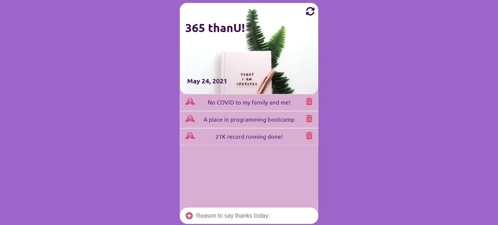

# 365-thanU App 

This is an app designed and created to list your reasons to say thankU every single day. As an opportunity to keep a grateful mind in your daily routine. Instead of make a to-do list app I prefer to make a variation with this project.

## Table of contents

  - [The challenge](#the-challenge)
  - [Links](#links)
  - [Built with](#built-with)
  - [Useful resources](#useful-resources)

## Overview

### The challenge

- Build out a beautiful and functional "thank list" for each day using HTML, CSS an JavaScript. 
The user can add a "thank reason" by filling the input and hit Enter, after that he/she can remove or not using delete button.
The user's thank list is stored in the local storage, so when refreshes the page, he/she can always find the list.
There is the possibility for the user, to clear the list, by clicking the button clear, at the top right corner of the app.
Finally, the 365 thankU app, shows the today's date to the user.

### Screenshot

### Links

- [Live demo](https://jeraldinnemg.github.io/365thanku/)

## My process

### Built with

- HTML5
- CSS3
- JavaScript

### Useful resources

- [.insertAdjacentHTML()](https://www.w3schools.com/jsref/met_node_insertadjacenthtml.asp)
- [toLocaleDateString()](https://developer.mozilla.org/es/docs/Web/JavaScript/Reference/Global_Objects/Date/toLocaleDateString)

### 